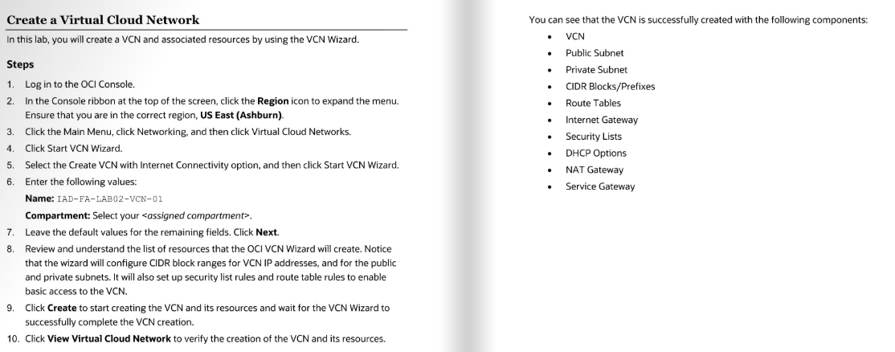

# Oracle Cloud Infrastructure (OCI) Labs 

This repo contains my completed hands-on labs for Oracle Cloud Infrastructure.  
Each lab includes screenshots, scripts, and notes.

---

## 1️⃣ Networking — Virtual Cloud Network 
*Configured Virtual Cloud Network with subnets, route table, and security list.*
  

.webp)

---

## 2️⃣ Networking — OCI Load Balancer
*OCI Load Balancer distributing traffic between two backend web servers.*
.webp)  

.webp)  

.webp)  

---

## 3️⃣ Compute — Web Server on Compute Instance
*Apache HTTP server deployed on OCI compute instance showing custom Hello World page.*
.webp)  

.webp)  

.webp)  

---

## 4️⃣ Object Storage — Manage OCI Object Storage
*Created Object Storage bucket and uploaded objects securely.*
.webp)

.webp)  

---

## 5️⃣ Block Storage — Attach Block Volume
*Attached block volume to VM instance and verified persistent storage.*
.webp)  

---

## 6️⃣ Security — Configure Security Zones
*Applied Maximum Security Zone policies with Cloud Guard enforcement.*
.webp)  

.webp) 

.webp)  

---

🔗 Connect with me on [LinkedIn](https://linkedin.com/in/faizanmirzatx)  
